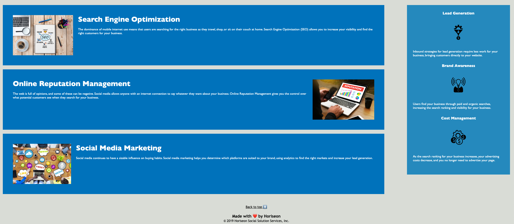

# Challenge Horiseon Accessibility Improvements

## Description

This project involves refactoring code for Horiseon, a digital marketing agency, with a focus on enhancing web accessibility. The goal is to enable people with disabilities to access the website through assistive technologies, such as video captions, screen readers, and braille keyboards. Improved accessibility not only boosts search engine rankings, particularly on platforms like Google, but also helps companies mitigate potential legal issues arising from inaccessible websites for people with disabilities.

### The following changes were made:
* Added semantic HTML elements 
* Consolidated the CSS elements and properties
* Added "back to top" link at the bottom of the page
* Added descriptive titles to all icon and image elements
* Added comments throughout the HTML and CSS files 

## Installation

To access the webpage, upload the starter package to the webserver. 

Please note that the layout is designed for desktop viewing. You may notice that some of the elements don't look like the mock-up in the screenshot below at a resolution smaller than 768px.

## Usage 

The webpage can be access using this URL: https://anadomuta.github.io/challenge-horiseon-accessibility/

To use the webpage, you can click on the sections in the navigation bar to get to the desired content section. Once on the bottom of the page, you can tap on the link "back to top" to navigate to the beginning of the page.

The screenshots below display the web page outlook.

## Credits

The project was built following the instructions from the materials in the Skills Bootcamp in Front-End Web Development by edX.

The following resources were used:
1. [Semantic Elements in HTML](https://www.w3schools.com/html/html5_semantic_elements.asp)
2. Duckett J. (2011). HTML & CSS : design and build websites. Wiley ; Wiley distributor. p.317
3. [Professional README Guide](https://coding-boot-camp.github.io/full-stack/github/professional-readme-guide)
4. [CSS Comments: Best Practices to Comment Like a Pro](https://www.positioniseverything.net/css-comments/)
5. [Ordering CSS properties - GitHub blog](https://github.com/necolas/idiomatic-css)
6. [Ordering CSS properties - Youtube video](https://www.youtube.com/watch?v=3Y03OSNw6zo)

## License

N/A

## Badges

